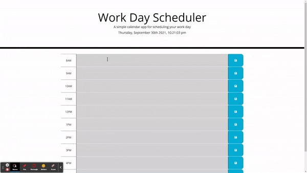

# Work Day Scheduler

Hourly calendar web app which allows users to save entries while tracking passage of time.
This app utilizes jQuery, Bootstrap, Moment, CSS, and HTML.

# Live Example

**Follow** [this link](https://helovedus1st.github.io/work-day-scheduler/) **to interact with the live application**

# Objectives

- Create an hourly planner application that enables busy employees to manage their time more effectively
- Always display the current date and time at the top of the planner
- Provide editable time blocks for common day-shift working hours
- Color code time blocks to provide visual representation of current time, past time, and future time
- When save button is clicked, then the user's entries persist despite page closure or refresh

# Screenshot
